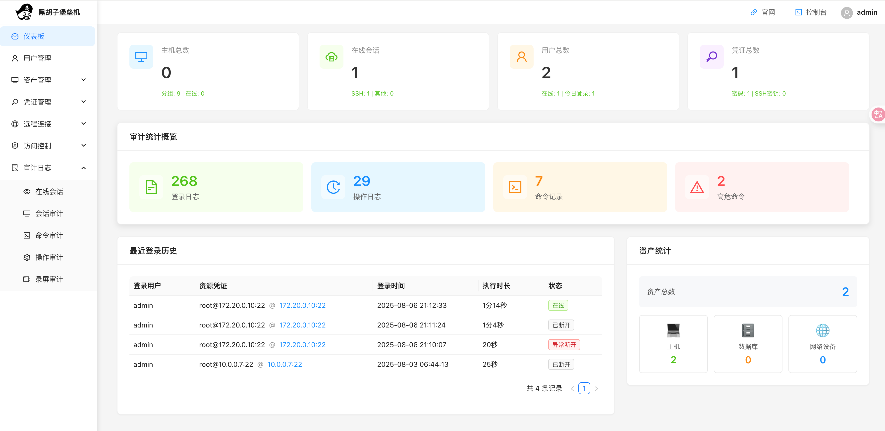
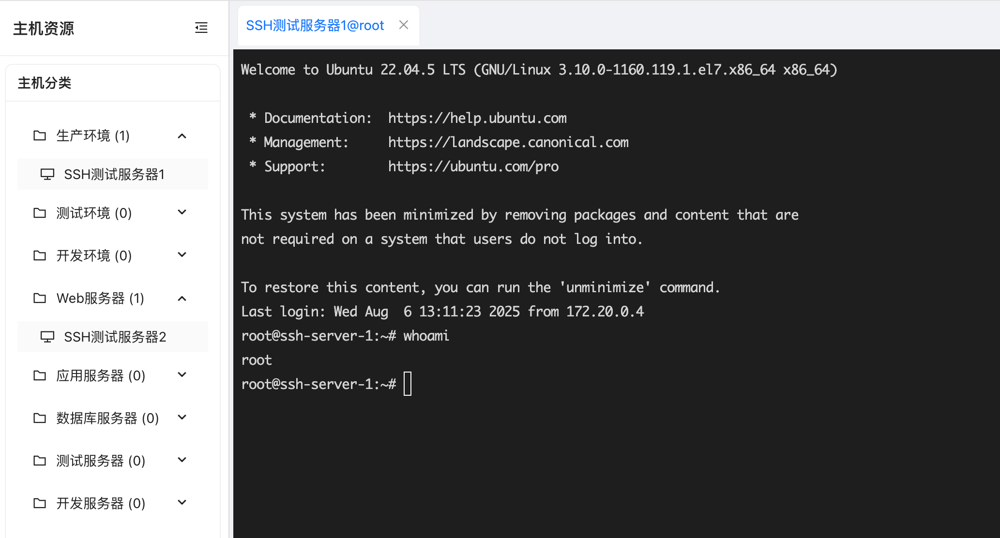
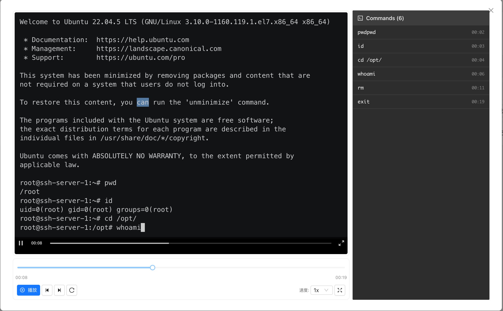
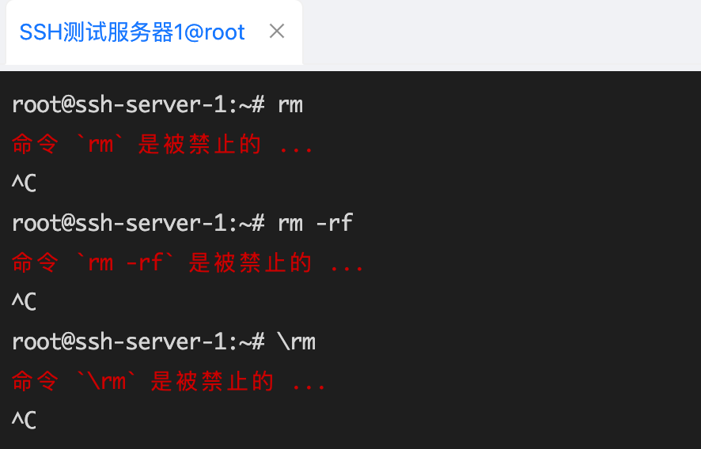
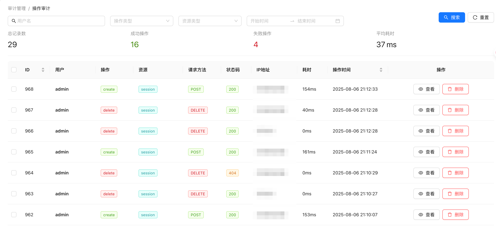
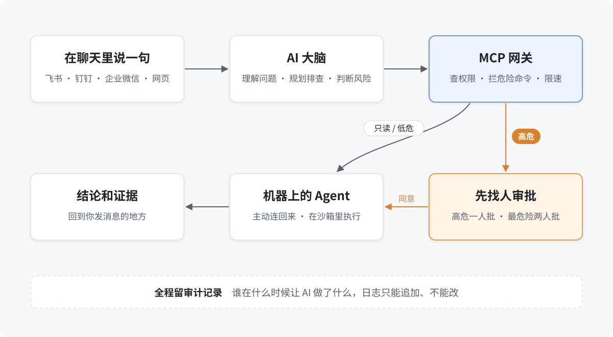

<div align="center">

# Captain Ops · 船长运维

An ops platform that keeps track of who can reach which machine and what they did there. Today it's a working bastion host; next, an AI assistant plugs into it.

[简体中文](README.md) · English

</div>



## What it is

Once you have enough servers and enough people, the worst questions are the ones nobody can answer: who logged into production, what did they type, who took the service down. Captain Ops tackles that in two steps.

**Step one, the bastion host (usable now).** Everyone reaches machines through it instead of connecting directly with shared passwords. Open a terminal from the browser in one click; every session is recorded and can be replayed like a video; dangerous commands such as `rm -rf` are blocked on the spot; logins, actions and every command typed go into the audit log.

**Step two, an AI ops assistant (being designed).** Ask in Feishu, DingTalk or WeCom, e.g. "why did this service go down again?", and the AI investigates on the machines and reports back with its evidence. The AI never touches servers itself; every command it comes up with goes through the same blocking, approval and audit as the bastion host.

> The bastion host is meant for learning and testing. It ships with default passwords and default keys; don't put it into production as is.

## What the bastion host does

<table>
<tr>
<td width="50%"><br><sub>Web terminal: pick a machine by group on the left, get a terminal on the right, several tabs at once</sub></td>
<td width="50%"><br><sub>Session replay: every login is recorded, with the commands listed on the right; click one to jump there</sub></td>
</tr>
<tr>
<td><br><sub>Command blocking: <code>rm</code>, <code>rm -rf</code> and the sneaky <code>\rm</code> are all caught</sub></td>
<td><br><sub>Operation audit: who did what, when and from where, one row at a time</sub></td>
</tr>
</table>

- **Users and permissions**: role-based (administrator, operator, auditor); every action checks permissions first.
- **Assets and credentials**: machines grouped by production, test, development and so on; passwords and keys are stored encrypted, so people can use them without ever seeing them.
- **Web terminal**: log into machines from the browser with no client to install; it reconnects on its own after a drop.
- **Command rules**: group commands, then deny, allow or alert on them per user, machine and login account.
- **Audit**: watch live sessions and kick them off; search login logs, action logs, command records and recordings by person, machine or time.

## Getting it running

You need Docker with Compose and about 4 GB of free memory.

```sh
git clone https://github.com/heihuzi-labs/captain-ops.git && cd captain-ops
docker compose up -d --build
```

Open http://localhost:8080 and sign in as `admin` / `admin123` (change the password first thing). Two test SSH servers are already set up, so you can try blocking and replay right away.

For local development without Docker and for importing the database, see [Docker deployment](docs/bastion/Docker部署.md) and the [database import guide](docs/bastion/数据库导入指南.md) (both in Chinese). `./manage.sh start|stop|restart|status|logs` manages the backend and frontend together during development.

**Change these before going live**: the `admin` password, the database password and JWT secret in `backend/config/config.yaml` and `docker/backend/config.docker.yaml`, and the MySQL password in `docker-compose.yml`.

## Next: the AI ops assistant



The AI does the thinking, not the doing. Every command it proposes goes to a gateway that checks permissions, runs it against the dangerous-command list and writes the audit record before an agent on the machine executes it. Actions fall into four levels:

| Level | For example | What happens |
| --- | --- | --- |
| Low | Reading logs, checking status, read-only queries | You see what will run, then it runs |
| Medium | Restarting a service, clearing temp files | You see it and must confirm |
| High | Rebooting a machine, changing config | One authorized person approves |
| Critical | Deleting data, formatting a disk | Two people approve, plus a final confirmation |

LLMs can be confidently wrong, so there are five checks between understanding the request and running anything: was it understood, are the parameters complete, how risky is it, is the command legal, and one last look before it runs. There are rate limits too: at most 3 high-risk commands per machine per hour, and at most 50 machines per batch.

The first milestone is a minimum usable version: one channel (Feishu), up to 10 machines, the 5 most common troubleshooting tools, with auditing and command blocking from day one. The full design is in [docs/ai-ops/](docs/ai-ops/) (in Chinese):

- [Technical white paper](docs/ai-ops/AI-Ops技术白皮书-完善版.md): architecture, execution and approval flows, security and compliance, high availability, hallucination safeguards, with diagrams
- [Risk assessment](docs/ai-ops/风险评估报告.md) · [API specification](docs/ai-ops/API规范.md) · [Database design](docs/ai-ops/数据库设计.md) · [Development plan](docs/ai-ops/开发计划.md)

## How it was built

The bastion host's backend (Go, about 24k lines) and frontend (React + TypeScript, about 27k lines) were written almost entirely by AI, mostly Claude Code with some Cursor. People wrote the requirements, made the calls and signed off.

Each feature started as a requirements doc, a design and a task list, which the AI then worked through step by step, followed by tests and a summary. Those files are kept in [.specs/](.specs/) (in Chinese).

## Layout

| Where | What |
| --- | --- |
| `backend/` | Backend: Go + Gin + GORM, JWT sign-in, WebSocket terminal, Redis |
| `frontend/` | Frontend: React 18 + TypeScript + Ant Design + xterm.js |
| `docker/`, `docker-compose.yml` | One-command deployment: frontend, backend, MySQL, Redis and two test SSH servers |
| `scripts/` | Schema, migration and cleanup scripts |
| `docs/bastion/` | Bastion host requirements, architecture, API, audit spec, command-blocking research |
| `docs/ai-ops/` | Design documents for the AI ops assistant |
| `.specs/` | Requirements, design and task records for each feature |

## License

[MIT](LICENSE).

---

<sub>Part of the Captain series from [heihuzi-labs](https://github.com/heihuzi-labs): [Captain Agents](https://github.com/heihuzi-labs/captain-agents) · [Captain Kube](https://github.com/heihuzi-labs/captain-kube) · **Captain Ops** · [Captain Todo](https://github.com/heihuzi-labs/captain-todo)</sub>
