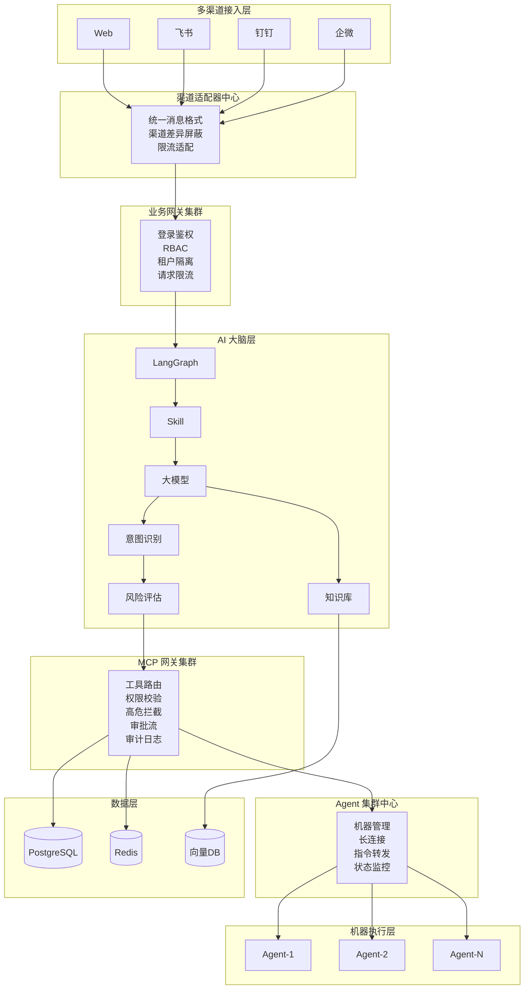
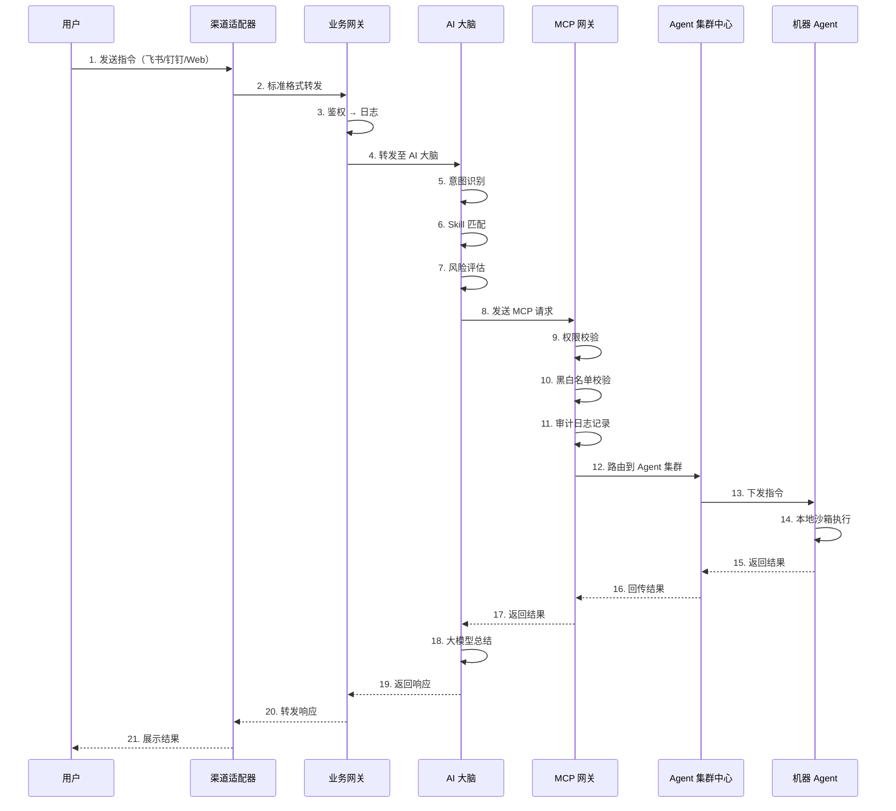
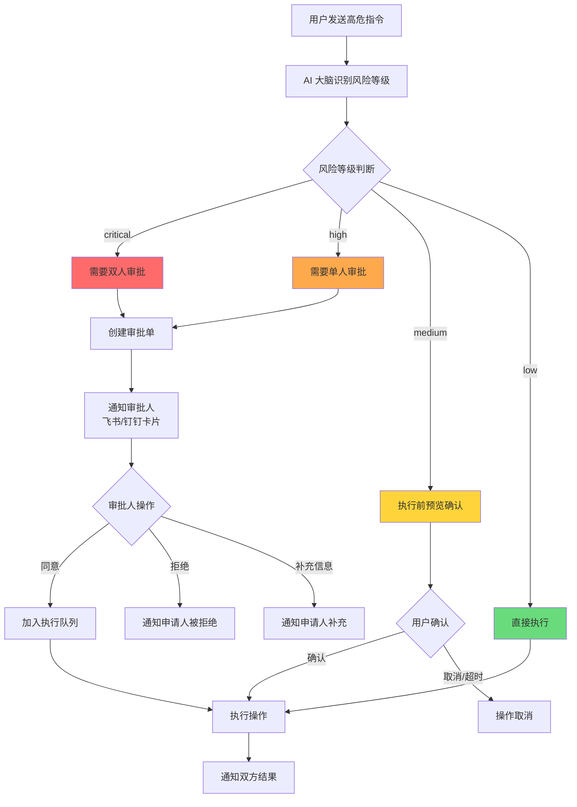
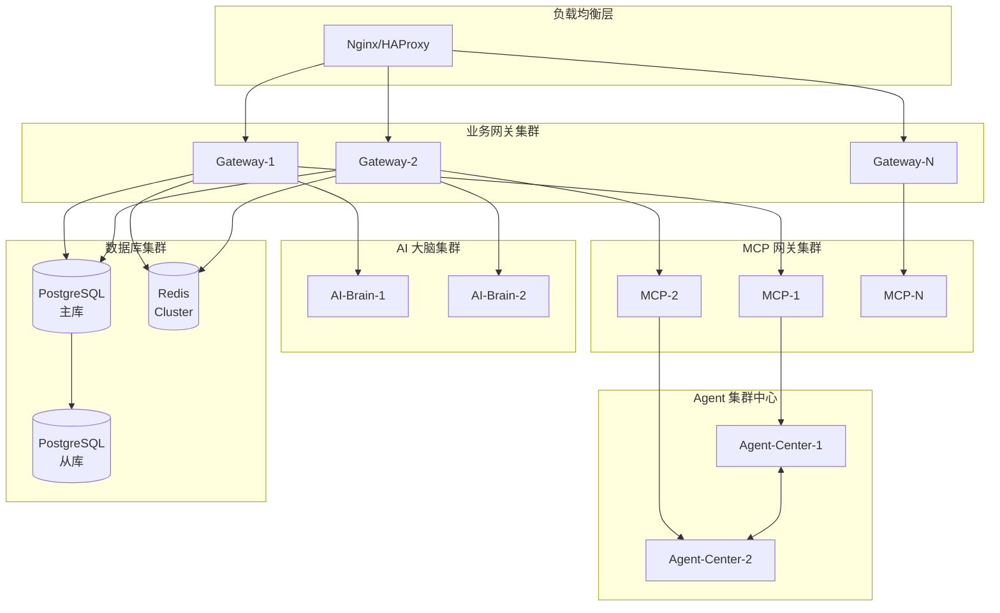
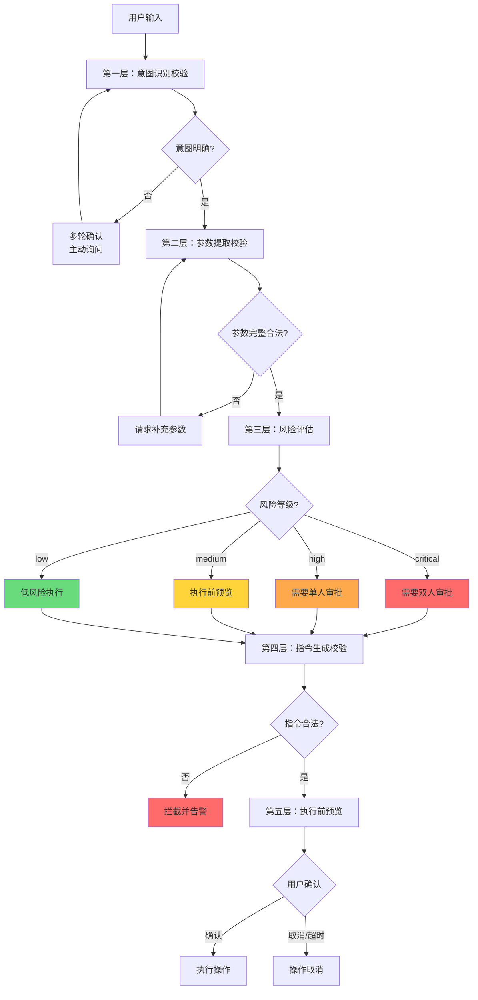

# AI-Ops 智能运维平台 — 完善版技术白皮书

> 基于原始方案的风险评估与优化建议，形成可落地、可汇报、可交付的最终版本
> 
> 版本：v2.0（完善版）
> 日期：2026-02-26

---

## 目录

1. [平台定位](#一平台定位)
2. [核心技术栈](#二核心技术栈最终锁定)
3. [整体架构](#三整体架构最终版)
4. [核心模块定义](#四核心模块定义)
5. [完整执行流程](#五完整执行流程最终定稿)
6. [安全与合规设计](#六安全与合规设计增强版)
7. [高可用设计](#七高可用设计新增)
8. [风险识别与应对策略](#八风险识别与应对策略新增)
9. [AI 幻觉防护机制](#九ai-幻觉防护机制新增)
10. [开发阶段规划](#十开发阶段规划)
11. [POC 验证清单](#十一poc-验证清单)
12. [架构总结](#十二架构总结)

---

## 一、平台定位

本平台为企业级私有化 AI 智能运维助手，基于 **LangGraph 工作流 + MCP 标准化工具协议 + 集群化 Agent + 多渠道交互** 构建，实现：

- ✅ 自动化故障排查
- ✅ 智能问答与知识库检索
- ✅ 高危操作管控与审批
- ✅ 全链路审计与合规
- ✅ 内网隔离、万台机器接入
- ✅ 多聊天渠道统一交互

**核心设计原则：**
- AI 不直接接触服务器，所有操作经过 MCP 网关
- 高危操作强制审批，低危操作限速
- 全操作可审计，日志不可篡改
- 最小权限原则，命令沙箱隔离

---

## 二、核心技术栈（最终锁定）

### 1. 前端
| 技术 | 用途 |
|------|------|
| React 18 + TypeScript | 管理后台 + 聊天界面 |
| Ant Design / Tailwind CSS | UI 组件库 |
| 状态管理 | Zustand / Jotai |

### 2. 管控层（Go 开发）
| 组件 | 职责 |
|------|------|
| 业务网关 | 用户、登录、权限、RBAC、会话管理 |
| MCP 网关 | 工具路由、权限、审计、高危拦截、审批、熔断限流 |
| 渠道适配器中心 | 多聊天渠道统一接入（飞书/钉钉/企微/Web） |
| Agent 集群中心 | 机器接入、长连接、状态管理、指令转发 |

### 3. AI 智能层（Python 开发）
| 组件 | 职责 |
|------|------|
| LangGraph 1.0 | 工作流编排、决策大脑 |
| Skill 业务能力单元 | 排障场景封装 |
| 大模型 | 意图识别、根因分析、回答生成 |
| OpenViking | 上下文记忆 |
| KoalaQA / PageIndex | 运维知识库 |

### 4. 执行层
| 组件 | 职责 |
|------|------|
| 集群化机器 Agent | 部署在目标机器，主动注册、长连接 |
| MCP 标准工具执行器 | 主机、K8s、日志、监控、DB 等工具 |

### 5. 存储与中间件
| 组件 | 用途 |
|------|------|
| PostgreSQL（主从） | 用户、权限、配置、审计日志 |
| Redis Cluster | 缓存、会话、任务队列、在线状态 |
| 对象存储（MinIO/S3） | 冷日志归档、知识库文档存储 |
| 向量数据库（Milvus/pgvector） | 知识库向量检索 |

---

## 三、整体架构（最终版）

### 3.1 架构图



---

## 四、核心模块定义

### 1. 业务网关（Go）

**职责：**
- 用户管理、角色权限、登录认证（JWT/OAuth2）
- 多租户隔离，tenant_id 全链路传递
- 后台管理接口统一入口
- 请求限流、日志、安全防护
- 唯一对外暴露服务

**高可用设计：**
- 无状态设计，支持水平扩展
- 多实例部署 + 负载均衡
- 配置中心（etcd/Consul）统一管理

### 2. AI 大脑（Python）

**职责：**
- 意图识别与参数提取
- Skill 路由与执行
- LangGraph 流程编排
- 大模型分析与总结
- **操作风险评估（新增）**
- **指令合理性校验（新增）**

**重要约束：**
- ⚠️ 不直接操作任何机器
- ⚠️ 所有指令必须经过 MCP 网关

### 3. MCP 网关（Go）

**职责：**
- 所有 MCP 工具的唯一入口
- MCP 注册与服务发现
- 操作权限与高危拦截
- 审批流控制
- 全链路审计日志
- 指令路由与超时熔断
- **命令白名单/黑名单校验（新增）**
- **操作限速控制（新增）**

**重要约束：**
- ⚠️ 不执行具体命令，只做路由和管控

**高可用设计：**
- 集群化部署 + 一致性哈希路由
- 降级策略：网关不可用时只允许只读操作
- 健康检查 + 自动故障转移

### 4. Agent 集群中心（Go）

**职责：**
- 管理所有机器 Agent 在线状态
- 维护长连接（gRPC 双向流）
- 指令下发与结果回执
- 机器分组、标签、批量管理
- 内网机器无缝接入

**高可用设计：**
- 集群化部署，支持 10K+ 并发连接
- 连接迁移：节点故障时自动迁移到其他节点
- 心跳检测 + 健康检查分离

### 5. 机器 Agent（类 OpenClaw）

**职责：**
- 部署在目标运维机器上
- 主动注册、主动连接、不暴露端口
- 接收 MCP 指令并执行
- 返回标准格式结果

**安全设计：**
- 最小权限、命令沙箱
- 指数退避重连
- 本地命令白名单校验

### 6. MCP 协议

**工具标准化接口规范：**
- 统一入参、出参、权限标识
- 风险等级标识（low/medium/high/critical）
- 支持工具类型：主机、K8s、日志、监控、DB、中间件

---

## 五、完整执行流程（最终定稿）

### 5.1 正常执行流程图



### 5.2 高危操作审批流程图



---

## 六、安全与合规设计（增强版）

### 基础安全

| 措施 | 说明 |
|------|------|
| AI 不直接接触服务器 | 全部经过 MCP 网关，可审计可拦截 |
| 高危操作强制审批 | critical/high 级别必须人工确认 |
| 最小权限原则 | 每个角色只能执行被授权的工具 |
| 内网隔离 | Agent 主动连接，不暴露端口 |
| 命令沙箱 | Agent 本地隔离执行，限制危险操作 |

### 审计日志安全（新增）

| 措施 | 说明 |
|------|------|
| 只追加存储 | 审计日志只能写入，不能修改/删除 |
| WORM 存储 | 关键日志写入一次写入多次读取存储 |
| 权限分离 | 系统管理员与审计管理员权限分离 |
| 日志校验 | 定期校验日志完整性，防止篡改 |
| 冷热分离 | 热数据 PostgreSQL，冷数据归档对象存储 |

### 命令安全（新增）

| 措施 | 说明 |
|------|------|
| 黑名单拦截 | rm -rf、dd、mkfs 等危险命令绝对禁止 |
| 白名单校验 | 只允许预定义的安全命令执行 |
| 参数校验 | 检查命令参数，防止注入攻击 |
| 超时控制 | 所有命令设置超时，防止卡死 |

### 合规支持

- ✅ 等保 2.0 三级要求
- ✅ 日志留存 180 天以上
- ✅ 操作可追溯、可审计
- ✅ 敏感操作双人确认

---

## 七、高可用设计（新增）

### 7.1 高可用架构图



### 7.2 单点故障消除

| 组件 | 高可用方案 |
|------|-----------|
| 业务网关 | 无状态 + 多实例 + 负载均衡 |
| MCP 网关 | 集群化 + 一致性哈希 + 故障转移 |
| Agent 集群中心 | 集群化 + 连接迁移 |
| PostgreSQL | 主从复制 + 自动故障转移 |
| Redis | Redis Cluster 模式 |
| AI 大脑 | 多实例 + 任务队列 |

### 降级策略

| 故障场景 | 降级方案 |
|---------|---------|
| MCP 网关部分不可用 | 流量切换到健康节点 |
| MCP 网关全部不可用 | 只允许只读操作 |
| AI 大脑不可用 | 降级为关键词匹配模式 |
| 知识库不可用 | 跳过知识库检索 |
| 单个 Agent 离线 | 标记机器不可用，跳过该机器 |

### Agent 连接管理

| 场景 | 处理方案 |
|------|---------|
| 大规模掉线 | 指数退避重连（1s → 2s → 4s → ... → 60s） |
| 心跳超时 | 90s 无心跳判定离线 |
| 重连风暴 | 随机抖动 + 批量限制 |
| 连接迁移 | 集群中心节点故障时自动迁移 |

---

## 八、风险识别与应对策略（新增）

### 🔴 高风险

| 风险 | 影响 | 应对策略 |
|------|------|---------|
| **AI 幻觉导致误操作** | 即使低危操作也可能造成故障 | 见「九、AI 幻觉防护机制」 |
| **MCP 网关单点故障** | 全平台瘫痪 | 集群化部署 + 降级策略 |
| **Agent 大规模掉线** | 冲击集群中心 | 指数退避 + 连接池优化 |
| **审计日志被篡改** | 合规风险 | WORM 存储 + 权限分离 |

### 🟡 中风险

| 风险 | 影响 | 应对策略 |
|------|------|---------|
| **渠道适配器兼容性** | 部分渠道功能异常 | 统一抽象层 + 专项测试 |
| **知识库质量差** | 检索结果不准确 | 混合检索 + 人工标注 |
| **多租户隔离不彻底** | 数据泄露风险 | tenant_id 全链路传递 + 数据隔离 |

### 🟢 低风险

| 风险 | 影响 | 应对策略 |
|------|------|---------|
| **LangGraph 学习曲线** | 开发周期延长 | 培训 + 文档沉淀 |
| **知识库冷启动** | 初期效果差 | 导入公开文档 + 内部 Wiki |

---

## 九、AI 幻觉防护机制（新增）

### 9.1 多重校验流程图



### 9.2 多重校验机制

```
用户输入
    ↓
┌─────────────────────────────────────────┐
│ 第一层：意图识别校验                      │
│ - 多轮确认，确保理解正确                   │
│ - 模糊意图主动询问                        │
└─────────────────────────────────────────┘
    ↓
┌─────────────────────────────────────────┐
│ 第二层：参数提取校验                      │
│ - 必填参数完整性检查                      │
│ - 参数格式合法性校验                      │
│ - 目标机器存在性校验                      │
└─────────────────────────────────────────┘
    ↓
┌─────────────────────────────────────────┐
│ 第三层：风险评估                          │
│ - 操作类型风险评级                        │
│ - 目标机器重要性评级                      │
│ - 组合风险计算                           │
└─────────────────────────────────────────┘
    ↓
┌─────────────────────────────────────────┐
│ 第四层：指令生成校验                      │
│ - MCP 指令格式校验                       │
│ - 命令黑名单校验                         │
│ - 参数注入检测                           │
└─────────────────────────────────────────┘
    ↓
┌─────────────────────────────────────────┐
│ 第五层：执行前预览（新增）                 │
│ - 展示即将执行的操作                      │
│ - 低危操作：1 分钟内不确认自动取消         │
│ - 高危操作：必须人工确认                  │
└─────────────────────────────────────────┘
    ↓
执行
```

### 风险评级标准

| 级别 | 操作类型 | 处理方式 |
|------|---------|---------|
| **low** | 查看日志、查看状态、只读查询 | 执行前预览，1 分钟不确认自动执行 |
| **medium** | 重启服务、清理临时文件 | 执行前预览，必须确认 |
| **high** | 重启机器、修改配置 | 需要审批（单人） |
| **critical** | 删除数据、格式化磁盘 | 需要审批（双人）+ 执行前确认 |

### 操作限速（新增）

| 限制类型 | 规则 |
|---------|------|
| 单机操作频率 | 同一机器 1 分钟内最多 10 条指令 |
| 高危操作频率 | 同一机器 1 小时内最多 3 条高危指令 |
| 批量操作限制 | 单次最多操作 50 台机器 |
| 用户操作频率 | 同一用户 1 分钟内最多 20 条指令 |

---

## 十、开发阶段规划

### Phase 1：MVP

**目标：验证核心链路可行性**

| 模块 | 交付内容 |
|------|---------|
| 业务网关 | 用户登录、RBAC、基础管理后台 |
| 渠道适配器 | 飞书机器人接入（单渠道） |
| AI 大脑 | 单轮对话 + 简单意图识别 + 风险评估 |
| MCP 网关 | 基础工具路由 + 审计日志 + 黑名单校验 |
| Agent 集群中心 | 单机版，支持 10 台机器 |
| MCP 工具 | 5 个核心工具（执行命令、查看日志、查看进程、查看端口、查看磁盘） |

### Phase 2：功能完善

**目标：生产可用**

| 模块 | 交付内容 |
|------|---------|
| Agent 集群化 | 支持 500+ 机器接入 |
| LangGraph 工作流 | 复杂排障场景（3+ 步骤） |
| 高危操作审批流 | 完整审批流程 |
| 知识库集成 | 向量检索 + FAQ |
| MCP 工具扩展 | K8s、监控、DB 工具 |
| 高可用 | 网关集群化 + 数据库主从 |

### Phase 3：生产化

**目标：大规模落地**

| 模块 | 交付内容 |
|------|---------|
| 多渠道支持 | 钉钉、企微、Web |
| Agent 规模化 | 万台级机器接入 |
| 完整审计 | 合规报告 + 日志归档 |
| 高可用完善 | 全链路高可用 + 故障演练 |
| 性能优化 | 压测 + 调优 |

---

## 十一、POC 验证清单

**正式开发前必须通过的验证项：**

### 技术验证

| 项目 | 验证内容 | 通过标准 |
|------|---------|---------|
| LangGraph 稳定性 | 多轮对话 + 工具调用 + 错误处理 | 100 次测试无崩溃 |
| MCP 工具调用 | AI → MCP 网关 → Agent → 返回 | 延迟 < 5s，成功率 > 99% |
| Agent 长连接 | 100 台机器 24 小时在线 | 掉线重连成功率 > 99% |
| 大模型性能 | DeepSeek/Qwen 本地推理 | 单次推理延迟 < 2s |

### 安全验证

| 项目 | 验证内容 | 通过标准 |
|------|---------|---------|
| 命令拦截 | 测试 100 条命令（含危险命令） | 拦截率 100% |
| 权限隔离 | 不同角色操作测试 | 越权操作拦截率 100% |
| 审计完整性 | 操作日志校验 | 日志完整率 100% |

---

## 十二、架构总结

### 一句话架构

> **多渠道接入 → 业务网关 → AI 大脑 → MCP 网关 → Agent 集群 → 机器执行**
> 
> 全流程可控、可审计、可大规模私有化落地

### 核心优势

| 优势 | 说明 |
|------|------|
| **安全可控** | AI 不直接接触服务器，全链路审计 |
| **高可用** | 核心组件集群化，降级策略完善 |
| **可扩展** | 微服务架构，横向扩展能力强 |
| **易落地** | 内网隔离、主动连接、无需暴露端口 |

### 关键创新点

1. **AI 幻觉多重防护** - 五层校验机制，最大限度降低误操作风险
2. **MCP 标准化** - 工具统一封装，易于扩展和管理
3. **高危操作审批流** - 智能识别风险等级，自动触发审批
4. **审计日志不可篡改** - WORM 存储 + 权限分离

---

## 附录：技术决策记录

| 决策 | 选择 | 原因 |
|------|------|------|
| Agent 通信协议 | gRPC 双向流 | 长连接稳定，支持异步回执 |
| 危险命令拦截 | 黑名单 + 白名单双轨 | rm -rf 等绝对禁止，自定义需审批 |
| 知识库检索 | 向量 + 关键词混合 | 纯向量有幻觉，混合更准确 |
| 审批通知 | 渠道原生卡片消息 | 用户体验好，支持快速审批 |
| 日志存储 | 冷热分离 | 成本优化，合规要求满足 |
| 风险评级 | 四级分类 | 区分处理，平衡效率和安全 |

---

*文档结束*
