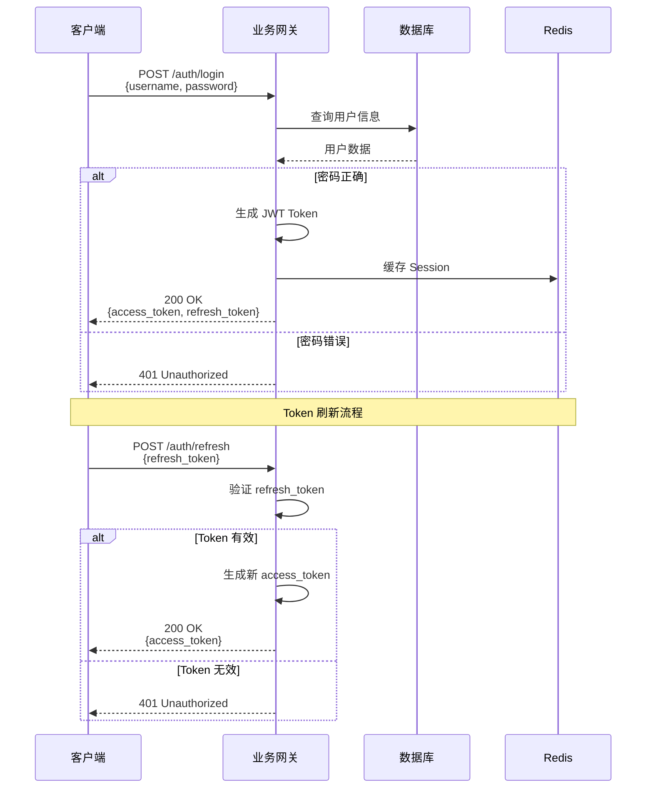
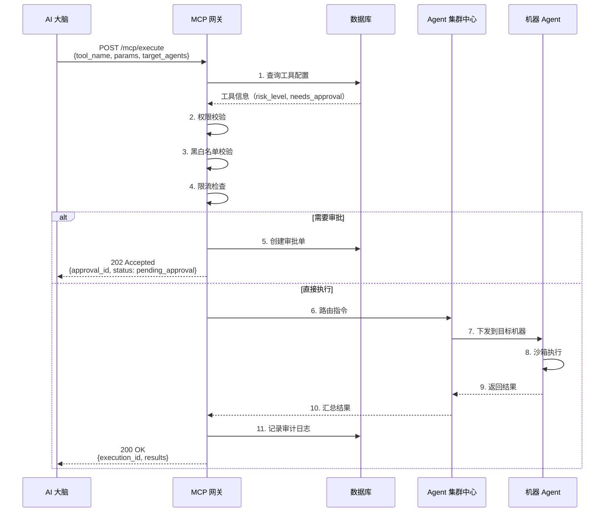

# AI-Ops 智能运维平台 — API 规范

> 版本：v1.2 | 日期：2026-02-26  
> API 风格：RESTful + gRPC  
> 基础路径：`/api/v1`

---

## 一、设计原则

1. 资源导向，HTTP 动词语义化
2. 统一响应包络：`success/code/message/data/error/request_id/timestamp`
3. JSON 字段统一 `snake_case`
4. ID 字段统一 `<resource>_id`
5. HTTP 状态码与业务码一一映射

---

## 二、通用规范

### 2.1 请求头

```http
Authorization: Bearer <jwt_token>
Content-Type: application/json
X-Tenant-ID: <tenant_id>
X-Request-ID: <uuid>                    // 可选，建议传入
X-Channel: feishu|dingtalk|wecom|web|api
```

### 2.2 统一响应格式

**成功响应**
```json
{
  "success": true,
  "code": 0,
  "message": "success",
  "data": {},
  "error": null,
  "request_id": "req-20260226-0001",
  "timestamp": 1708900000
}
```

**错误响应**
```json
{
  "success": false,
  "code": 40001,
  "message": "invalid_parameter",
  "data": null,
  "error": {
    "error_type": "validation_error",
    "details": [
      {"field": "username", "message": "username_is_required"}
    ]
  },
  "request_id": "req-20260226-0001",
  "timestamp": 1708900000
}
```

### 2.3 分页规范

**请求参数**
```text
?page=1&page_size=20
或
?cursor=next_cursor&page_size=20
```

**响应结构**
```json
{
  "success": true,
  "code": 0,
  "message": "success",
  "data": {
    "items": [],
    "pagination": {
      "page": 1,
      "page_size": 20,
      "total": 100,
      "total_pages": 5,
      "has_next": true,
      "next_cursor": "xxx"
    }
  },
  "error": null,
  "request_id": "req-20260226-0002",
  "timestamp": 1708900000
}
```

### 2.4 HTTP 状态码与业务码

| HTTP | 场景 | 业务码范围 |
|------|------|-----------|
| 200 | 查询/更新/删除成功 | 0 |
| 201 | 创建成功 | 0 |
| 202 | 请求已受理（异步/待审批） | 202xx |
| 400 | 参数错误 | 400xx |
| 401 | 未认证/Token 失效 | 401xx |
| 403 | 权限不足 | 403xx |
| 404 | 资源不存在 | 404xx |
| 409 | 资源冲突 | 409xx |
| 422 | 业务校验失败 | 422xx |
| 429 | 请求频率超限 | 429xx |
| 500 | 内部错误 | 500xx |
| 503 | 服务不可用/降级 | 503xx |

### 2.5 业务错误码

| 错误码 | 说明 |
|--------|------|
| 0 | 成功 |
| 20201 | 操作已受理，等待审批 |
| 40001 | 参数校验失败 |
| 40002 | 参数格式错误 |
| 40101 | 未登录 |
| 40102 | Token 失效 |
| 40103 | Token 格式错误 |
| 40301 | 无权限 |
| 40302 | 权限不足 |
| 40401 | 资源不存在 |
| 40901 | 资源已存在 |
| 40902 | 操作冲突 |
| 42201 | 业务状态不允许 |
| 42901 | 请求过于频繁 |
| 50001 | 内部错误 |
| 50301 | 服务降级 |
| 50302 | 服务维护中 |

---

## 三、业务网关 API

### 3.0 认证流程图



### 3.1 认证模块

```text
POST /api/v1/auth/login
POST /api/v1/auth/refresh
POST /api/v1/auth/logout
GET  /api/v1/auth/me
```

**登录请求体**
```json
{
  "username": "admin",
  "password": "password123",
  "channel": "web"
}
```

**登录响应**
```json
{
  "success": true,
  "code": 0,
  "message": "success",
  "data": {
    "access_token": "eyJhbGciOiJIUzI1NiIs...",
    "refresh_token": "eyJhbGciOiJIUzI1NiIs...",
    "expires_in": 7200,
    "user": {
      "user_id": 1,
      "username": "admin",
      "display_name": "管理员",
      "roles": [
        {"role_id": 1, "name": "管理员", "code": "admin"}
      ]
    }
  },
  "error": null,
  "request_id": "req-20260226-1001",
  "timestamp": 1708900000
}
```

### 3.2 用户与角色

```text
GET    /api/v1/users
POST   /api/v1/users
PUT    /api/v1/users/{user_id}
DELETE /api/v1/users/{user_id}
POST   /api/v1/users/{user_id}/password

GET    /api/v1/roles
POST   /api/v1/roles
PUT    /api/v1/roles/{role_id}
DELETE /api/v1/roles/{role_id}
```

### 3.3 Agent 与分组

```text
GET    /api/v1/agents
GET    /api/v1/agents/{agent_id}
GET    /api/v1/agents/stats

GET    /api/v1/agent-groups
POST   /api/v1/agent-groups
PUT    /api/v1/agent-groups/{group_id}
DELETE /api/v1/agent-groups/{group_id}
POST   /api/v1/agent-groups/{group_id}/agents
DELETE /api/v1/agent-groups/{group_id}/agents/{agent_id}
```

### 3.4 会话与审批

```text
GET  /api/v1/sessions
GET  /api/v1/sessions/{session_id}
POST /api/v1/sessions/{session_id}/close

GET  /api/v1/approvals
GET  /api/v1/approvals/{approval_id}
POST /api/v1/approvals/{approval_id}/approve
POST /api/v1/approvals/{approval_id}/reject
POST /api/v1/approvals/{approval_id}/cancel
```

**审批列表示例响应**
```json
{
  "success": true,
  "code": 0,
  "message": "success",
  "data": {
    "items": [
      {
        "approval_id": "apr-20260226001",
        "user": {"user_id": 2, "username": "zhangsan"},
        "operation_type": "restart_service",
        "operation_desc": "重启 nginx 服务",
        "mcp_tool_name": "execute_command",
        "mcp_tool_params": {"command": "systemctl restart nginx"},
        "target_agents": [
          {"agent_id": "agent-001", "hostname": "prod-web-01"}
        ],
        "risk_level": "medium",
        "status": "pending",
        "created_at": "2026-02-26T01:00:00Z",
        "expires_at": "2026-02-26T02:00:00Z"
      }
    ],
    "pagination": {
      "page": 1,
      "page_size": 20,
      "total": 1,
      "total_pages": 1,
      "has_next": false,
      "next_cursor": null
    }
  },
  "error": null,
  "request_id": "req-20260226-2001",
  "timestamp": 1708900000
}
```

### 3.5 MCP 工具与知识库

```text
GET    /api/v1/mcp-tools
GET    /api/v1/mcp-tools/{tool_id}
POST   /api/v1/mcp-tools
PUT    /api/v1/mcp-tools/{tool_id}
DELETE /api/v1/mcp-tools/{tool_id}
GET    /api/v1/mcp-tools/{tool_id}/permissions
POST   /api/v1/mcp-tools/{tool_id}/permissions

GET    /api/v1/knowledge-bases
POST   /api/v1/knowledge-bases
GET    /api/v1/knowledge-bases/{kb_id}/documents
POST   /api/v1/knowledge-bases/{kb_id}/documents
DELETE /api/v1/knowledge-bases/{kb_id}/documents/{doc_id}
GET    /api/v1/knowledge-bases/{kb_id}/faqs
POST   /api/v1/knowledge-bases/{kb_id}/faqs
PUT    /api/v1/knowledge-bases/{kb_id}/faqs/{faq_id}
DELETE /api/v1/knowledge-bases/{kb_id}/faqs/{faq_id}
```

### 3.6 审计日志与渠道配置

```text
GET  /api/v1/audit-logs
GET  /api/v1/audit-logs/{log_id}
GET  /api/v1/audit-logs/export

GET  /api/v1/channels
POST /api/v1/channels
POST /api/v1/channels/{channel_id}/test
```

**审计日志查询示例响应（对齐风险评估 R4）**
```json
{
  "success": true,
  "code": 0,
  "message": "success",
  "data": {
    "log_id": "alog-20260226001",
    "action_type": "execute_command",
    "status": "success",
    "checksum": "sha256:7de2b7...",
    "immutable": true,
    "created_at": "2026-02-26T01:00:00Z"
  },
  "error": null,
  "request_id": "req-20260226-3001",
  "timestamp": 1708900000
}
```

---

## 四、MCP 网关 API

### 4.0 MCP 工具执行流程图



### 4.1 工具执行

```text
POST /api/v1/mcp/execute
GET  /api/v1/mcp/executions/{execution_id}
POST /api/v1/mcp/batch-execute
```

**执行请求体**
```json
{
  "session_id": "sess-001",
  "message_id": "msg-001",
  "mcp_tool_name": "execute_command",
  "mcp_tool_params": {
    "command": "tail -n 100 /var/log/nginx/access.log",
    "timeout_seconds": 30
  },
  "target_agents": ["agent-001", "agent-002"],
  "dry_run": false
}
```

**执行响应（同步，HTTP 200）**
```json
{
  "success": true,
  "code": 0,
  "message": "success",
  "data": {
    "execution_id": "exec-001",
    "mcp_tool_name": "execute_command",
    "status": "success",
    "target_agents": ["agent-001"],
    "results": [
      {
        "agent_id": "agent-001",
        "status": "success",
        "stdout": "日志内容...",
        "stderr": "",
        "exit_code": 0,
        "duration_ms": 156
      }
    ],
    "risk_level": "low",
    "risk_reason": "read_only_operation",
    "requires_approval": false,
    "approval_id": null,
    "rate_limit": {
      "limit": 20,
      "remaining": 19,
      "reset_at": "2026-02-26T01:01:00Z"
    },
    "created_at": "2026-02-26T01:00:00Z"
  },
  "error": null,
  "request_id": "req-20260226-4001",
  "timestamp": 1708900000
}
```

**执行响应（待审批，HTTP 202）**
```json
{
  "success": true,
  "code": 20201,
  "message": "accepted",
  "data": {
    "execution_id": "exec-001",
    "status": "pending_approval",
    "requires_approval": true,
    "approval_id": "apr-001",
    "approval_url": "https://xxx/approvals/apr-001"
  },
  "error": null,
  "request_id": "req-20260226-4002",
  "timestamp": 1708900000
}
```

### 4.2 工具注册（内部）

```text
POST   /internal/v1/mcp/tools/register
DELETE /internal/v1/mcp/tools/{tool_name}
POST   /internal/v1/mcp/tools/{tool_name}/heartbeat
```

---

## 五、Agent 集群中心 gRPC API

```protobuf
service AgentService {
  rpc Connect(stream AgentMessage) returns (stream ServerMessage);
}

message AgentMessage {
  oneof message {
    RegisterRequest register = 1;
    HeartbeatRequest heartbeat = 2;
    ExecuteResponse execute_response = 3;
  }
}

message ServerMessage {
  oneof message {
    RegisterResponse register = 1;
    ExecuteRequest execute = 2;
    HeartbeatResponse heartbeat = 3;
  }
}

message RegisterRequest {
  string agent_id = 1;
  string hostname = 2;
  string ip = 3;
  string os_type = 4;
  map<string, string> labels = 5;
  string agent_version = 6;
}

message ExecuteRequest {
  string execution_id = 1;
  string mcp_tool_name = 2;
  string mcp_tool_params_json = 3;
  int32 timeout_seconds = 4;
}
```

---

## 六、AI 大脑 API

### 6.1 对话接口

```text
POST /api/v1/chat/messages
POST /api/v1/chat/messages/{message_id}/confirm
```

**发送消息请求**
```json
{
  "session_id": "sess-001",
  "content": "查看 prod-web-01 的 nginx 日志，最近 100 行",
  "channel": "feishu",
  "context": {}
}
```

**发送消息响应（对齐风险评估 R1）**
```json
{
  "success": true,
  "code": 0,
  "message": "success",
  "data": {
    "message_id": "msg-001",
    "content": "好的，我来帮你查看日志...",
    "intent_name": "view_logs",
    "intent_candidates": [
      {"intent_name": "view_logs", "confidence": 0.98},
      {"intent_name": "service_status", "confidence": 0.02}
    ],
    "skill_used": "log_viewer",
    "mcp_execution": {
      "execution_id": "exec-001",
      "status": "success"
    },
    "risk_level": "low",
    "risk_reason": "read_only_operation",
    "needs_preview": false,
    "preview_token": null
  },
  "error": null,
  "request_id": "req-20260226-5001",
  "timestamp": 1708900000
}
```

**预览确认请求**
```json
{
  "confirm_action": "approve",
  "preview_token": "pvt-001",
  "confirm_comment": "确认执行"
}
```

**预览确认响应**
```json
{
  "success": true,
  "code": 0,
  "message": "success",
  "data": {
    "message_id": "msg-001",
    "execution_id": "exec-001",
    "status": "queued"
  },
  "error": null,
  "request_id": "req-20260226-5002",
  "timestamp": 1708900000
}
```

---

## 七、渠道适配器 API

```text
POST /api/v1/webhooks/feishu
POST /api/v1/webhooks/dingtalk
POST /api/v1/webhooks/wecom
```

---

## 八、安全与限流

- 外部 API：JWT Bearer Token
- 内部 API：mTLS + Service Token
- 多租户隔离：所有业务请求必须携带 `X-Tenant-ID`（对齐风险评估 R7）

| API | 限流策略 |
|-----|---------|
| `/api/v1/chat/*` | 100 req/min/user |
| `/api/v1/mcp/execute` | 20 req/min/user |
| `/api/v1/audit-logs` | 60 req/min/user |
| `/internal/*` | 1000 req/min/service |

---

*文档结束*
