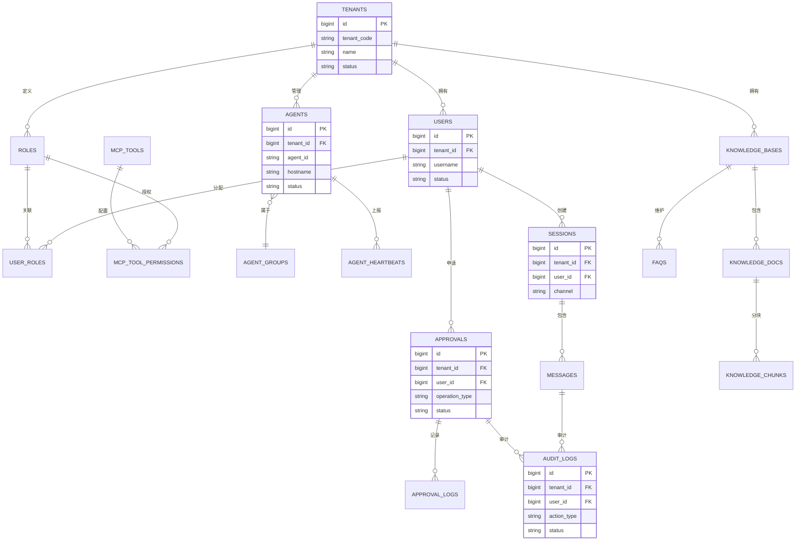

# AI-Ops 智能运维平台 — 数据库设计

> 版本：v1.0 | 日期：2026-02-26
> 
> 数据库：PostgreSQL 15+

---

## 一、设计原则

1. **多租户隔离**：所有业务表包含 `tenant_id`，全链路传递
2. **审计优先**：关键操作日志只追加，不可修改/删除
3. **性能优先**：热点数据索引优化，冷数据分表归档
4. **扩展性**：预留扩展字段，支持未来需求

---

## 二、数据库架构

### 2.1 架构概览

```
PostgreSQL 集群
├── 主库（写入）
├── 从库（读取）
└── 分表策略
    ├── 热数据：最近 30 天
    ├── 温数据：30-180 天
    └── 冷数据：> 180 天（归档对象存储）
```

### 2.2 核心表关系图



---

## 三、Schema 设计

### 3.1 租户与用户模块

#### tenants（租户表）
```sql
CREATE TABLE tenants (
    id              BIGSERIAL PRIMARY KEY,
    tenant_code     VARCHAR(64) UNIQUE NOT NULL,      -- 租户代码
    name            VARCHAR(256) NOT NULL,            -- 租户名称
    status          VARCHAR(32) DEFAULT 'active',     -- active/suspended/deleted
    config          JSONB DEFAULT '{}',               -- 租户配置
    created_at      TIMESTAMP DEFAULT CURRENT_TIMESTAMP,
    updated_at      TIMESTAMP DEFAULT CURRENT_TIMESTAMP
);

CREATE INDEX idx_tenants_code ON tenants(tenant_code);
CREATE INDEX idx_tenants_status ON tenants(status);
```

#### users（用户表）
```sql
CREATE TABLE users (
    id              BIGSERIAL PRIMARY KEY,
    tenant_id       BIGINT NOT NULL REFERENCES tenants(id),
    username        VARCHAR(128) NOT NULL,            -- 用户名
    password_hash   VARCHAR(256),                     -- 密码哈希（可选，SSO 用户无密码）
    email           VARCHAR(256),                     -- 邮箱
    phone           VARCHAR(32),                      -- 手机号
    display_name    VARCHAR(256),                     -- 显示名称
    avatar_url      VARCHAR(1024),                    -- 头像 URL
    status          VARCHAR(32) DEFAULT 'active',     -- active/inactive/locked
    last_login_at   TIMESTAMP,                        -- 最后登录时间
    last_login_ip   VARCHAR(64),                      -- 最后登录 IP
    created_at      TIMESTAMP DEFAULT CURRENT_TIMESTAMP,
    updated_at      TIMESTAMP DEFAULT CURRENT_TIMESTAMP,
    
    UNIQUE(tenant_id, username)
);

CREATE INDEX idx_users_tenant ON users(tenant_id);
CREATE INDEX idx_users_username ON users(username);
CREATE INDEX idx_users_email ON users(email);
CREATE INDEX idx_users_status ON users(status);
```

#### roles（角色表）
```sql
CREATE TABLE roles (
    id              BIGSERIAL PRIMARY KEY,
    tenant_id       BIGINT NOT NULL REFERENCES tenants(id),
    name            VARCHAR(128) NOT NULL,            -- 角色名称
    code            VARCHAR(64) NOT NULL,             -- 角色代码
    description     TEXT,                             -- 角色描述
    permissions     JSONB DEFAULT '[]',               -- 权限列表
    is_system       BOOLEAN DEFAULT FALSE,            -- 是否系统角色
    created_at      TIMESTAMP DEFAULT CURRENT_TIMESTAMP,
    updated_at      TIMESTAMP DEFAULT CURRENT_TIMESTAMP,
    
    UNIQUE(tenant_id, code)
);

CREATE INDEX idx_roles_tenant ON roles(tenant_id);
CREATE INDEX idx_roles_code ON roles(code);
```

#### user_roles（用户角色关联表）
```sql
CREATE TABLE user_roles (
    id              BIGSERIAL PRIMARY KEY,
    tenant_id       BIGINT NOT NULL,
    user_id         BIGINT NOT NULL REFERENCES users(id),
    role_id         BIGINT NOT NULL REFERENCES roles(id),
    created_at      TIMESTAMP DEFAULT CURRENT_TIMESTAMP,
    
    UNIQUE(user_id, role_id)
);

CREATE INDEX idx_user_roles_user ON user_roles(user_id);
CREATE INDEX idx_user_roles_role ON user_roles(role_id);
CREATE INDEX idx_user_roles_tenant ON user_roles(tenant_id);
```

---

### 3.2 机器与 Agent 模块

#### agents（机器 Agent 表）
```sql
CREATE TABLE agents (
    id              BIGSERIAL PRIMARY KEY,
    tenant_id       BIGINT NOT NULL,
    agent_id        VARCHAR(128) UNIQUE NOT NULL,     -- Agent 唯一标识
    hostname        VARCHAR(256) NOT NULL,            -- 主机名
    ip              VARCHAR(64) NOT NULL,             -- IP 地址
    port            INTEGER DEFAULT 0,                -- 端口（通常不需要）
    os_type         VARCHAR(32),                      -- linux/windows/darwin
    os_version      VARCHAR(128),                     -- 操作系统版本
    cpu_cores       INTEGER,                          -- CPU 核数
    memory_gb       DECIMAL(10,2),                    -- 内存大小（GB）
    disk_gb         DECIMAL(10,2),                    -- 磁盘大小（GB）
    labels          JSONB DEFAULT '{}',               -- 标签 {"env":"prod","region":"sh"}
    group_id        BIGINT,                           -- 所属分组
    status          VARCHAR(32) DEFAULT 'offline',    -- online/offline/maintenance
    agent_version   VARCHAR(64),                      -- Agent 版本
    last_heartbeat  TIMESTAMP,                        -- 最后心跳时间
    registered_at   TIMESTAMP DEFAULT CURRENT_TIMESTAMP,
    created_at      TIMESTAMP DEFAULT CURRENT_TIMESTAMP,
    updated_at      TIMESTAMP DEFAULT CURRENT_TIMESTAMP
);

CREATE INDEX idx_agents_tenant ON agents(tenant_id);
CREATE INDEX idx_agents_agent_id ON agents(agent_id);
CREATE INDEX idx_agents_hostname ON agents(hostname);
CREATE INDEX idx_agents_status ON agents(status);
CREATE INDEX idx_agents_group ON agents(group_id);
CREATE INDEX idx_agents_labels ON agents USING GIN(labels);
```

#### agent_groups（机器分组表）
```sql
CREATE TABLE agent_groups (
    id              BIGSERIAL PRIMARY KEY,
    tenant_id       BIGINT NOT NULL,
    name            VARCHAR(256) NOT NULL,            -- 分组名称
    description     TEXT,                             -- 分组描述
    parent_id       BIGINT REFERENCES agent_groups(id),-- 父分组
    created_at      TIMESTAMP DEFAULT CURRENT_TIMESTAMP,
    updated_at      TIMESTAMP DEFAULT CURRENT_TIMESTAMP
);

CREATE INDEX idx_agent_groups_tenant ON agent_groups(tenant_id);
CREATE INDEX idx_agent_groups_parent ON agent_groups(parent_id);
```

#### agent_heartbeats（心跳记录表，热数据）
```sql
CREATE TABLE agent_heartbeats (
    id              BIGSERIAL PRIMARY KEY,
    tenant_id       BIGINT NOT NULL,
    agent_id        VARCHAR(128) NOT NULL,
    heartbeat_at    TIMESTAMP NOT NULL,               -- 心跳时间
    status          VARCHAR(32),                      -- 状态
    metrics         JSONB DEFAULT '{}',               -- 指标数据
    
    PARTITION BY RANGE (heartbeat_at)
);

-- 创建分区（每月一个分区）
CREATE TABLE agent_heartbeats_202602 PARTITION OF agent_heartbeats
    FOR VALUES FROM ('2026-02-01') TO ('2026-03-01');

CREATE INDEX idx_heartbeats_agent ON agent_heartbeats(agent_id);
CREATE INDEX idx_heartbeats_time ON agent_heartbeats(heartbeat_at);
```

---

### 3.3 MCP 工具模块

#### mcp_tools（MCP 工具注册表）
```sql
CREATE TABLE mcp_tools (
    id              BIGSERIAL PRIMARY KEY,
    tenant_id       BIGINT NOT NULL,
    tool_name       VARCHAR(128) NOT NULL,            -- 工具名称
    tool_type       VARCHAR(64) NOT NULL,             -- 工具类型（host/k8s/log/monitor/db）
    description     TEXT,                             -- 工具描述
    params_schema   JSONB NOT NULL,                   -- 参数 JSON Schema
    returns_schema  JSONB,                            -- 返回 JSON Schema
    risk_level      VARCHAR(32) DEFAULT 'low',        -- low/medium/high/critical
    needs_approval  BOOLEAN DEFAULT FALSE,            -- 是否需要审批
    approval_config JSONB DEFAULT '{}',               -- 审批配置
    blocked_params  JSONB DEFAULT '[]',               -- 禁止的参数值
    timeout_seconds INTEGER DEFAULT 30,               -- 超时时间
    status          VARCHAR(32) DEFAULT 'active',     -- active/inactive/deleted
    created_at      TIMESTAMP DEFAULT CURRENT_TIMESTAMP,
    updated_at      TIMESTAMP DEFAULT CURRENT_TIMESTAMP,
    
    UNIQUE(tenant_id, tool_name)
);

CREATE INDEX idx_mcp_tools_tenant ON mcp_tools(tenant_id);
CREATE INDEX idx_mcp_tools_type ON mcp_tools(tool_type);
CREATE INDEX idx_mcp_tools_risk ON mcp_tools(risk_level);
```

#### mcp_tool_permissions（工具权限表）
```sql
CREATE TABLE mcp_tool_permissions (
    id              BIGSERIAL PRIMARY KEY,
    tenant_id       BIGINT NOT NULL,
    role_id         BIGINT NOT NULL REFERENCES roles(id),
    tool_id         BIGINT NOT NULL REFERENCES mcp_tools(id),
    allowed_actions JSONB DEFAULT '["execute"]',      -- 允许的操作
    created_at      TIMESTAMP DEFAULT CURRENT_TIMESTAMP,
    
    UNIQUE(role_id, tool_id)
);

CREATE INDEX idx_tool_perms_role ON mcp_tool_permissions(role_id);
CREATE INDEX idx_tool_perms_tool ON mcp_tool_permissions(tool_id);
```

---

### 3.4 会话与对话模块

#### sessions（会话表）
```sql
CREATE TABLE sessions (
    id              BIGSERIAL PRIMARY KEY,
    tenant_id       BIGINT NOT NULL,
    session_id      VARCHAR(128) UNIQUE NOT NULL,     -- 会话 ID
    user_id         BIGINT NOT NULL REFERENCES users(id),
    channel         VARCHAR(32) NOT NULL,             -- feishu/dingtalk/wem/rap/web
    channel_user_id VARCHAR(256),                     -- 渠道用户 ID
    channel_chat_id VARCHAR(256),                     -- 渠道聊天 ID
    status          VARCHAR(32) DEFAULT 'active',     -- active/closed
    context         JSONB DEFAULT '{}',               -- 会话上下文
    created_at      TIMESTAMP DEFAULT CURRENT_TIMESTAMP,
    updated_at      TIMESTAMP DEFAULT CURRENT_TIMESTAMP,
    closed_at       TIMESTAMP
);

CREATE INDEX idx_sessions_tenant ON sessions(tenant_id);
CREATE INDEX idx_sessions_session_id ON sessions(session_id);
CREATE INDEX idx_sessions_user ON sessions(user_id);
CREATE INDEX idx_sessions_channel ON sessions(channel, channel_chat_id);
```

#### messages（消息表）
```sql
CREATE TABLE messages (
    id              BIGSERIAL PRIMARY KEY,
    tenant_id       BIGINT NOT NULL,
    session_id      VARCHAR(128) NOT NULL,
    message_id      VARCHAR(128) UNIQUE NOT NULL,     -- 消息 ID
    role            VARCHAR(32) NOT NULL,             -- user/assistant/system
    content         TEXT NOT NULL,                    -- 消息内容
    intent          VARCHAR(256),                     -- 识别的意图
    skill_used      VARCHAR(128),                     -- 使用的 Skill
    mcp_tool_used   VARCHAR(128),                     -- 使用的 MCP 工具
    risk_level      VARCHAR(32),                      -- 风险等级
    tokens_used     INTEGER,                          -- 消耗的 Token 数
    latency_ms      INTEGER,                          -- 响应延迟（毫秒）
    created_at      TIMESTAMP DEFAULT CURRENT_TIMESTAMP
);

CREATE INDEX idx_messages_session ON messages(session_id);
CREATE INDEX idx_messages_tenant ON messages(tenant_id);
CREATE INDEX idx_messages_time ON messages(created_at);

-- 按月分区
-- CREATE TABLE messages_202602 PARTITION OF messages
--     FOR VALUES FROM ('2026-02-01') TO ('2026-03-01');
```

---

### 3.5 审批流模块

#### approvals（审批单表）
```sql
CREATE TABLE approvals (
    id              BIGSERIAL PRIMARY KEY,
    tenant_id       BIGINT NOT NULL,
    approval_id     VARCHAR(128) UNIQUE NOT NULL,     -- 审批单 ID
    user_id         BIGINT NOT NULL REFERENCES users(id),
    session_id      VARCHAR(128),                     -- 关联会话
    message_id      VARCHAR(128),                     -- 关联消息
    
    -- 操作信息
    operation_type  VARCHAR(64) NOT NULL,             -- 操作类型
    operation_desc  TEXT NOT NULL,                    -- 操作描述
    mcp_tool        VARCHAR(128) NOT NULL,            -- MCP 工具
    mcp_params      JSONB NOT NULL,                   -- MCP 参数
    target_agents   JSONB NOT NULL,                   -- 目标机器列表
    
    -- 风险评估
    risk_level      VARCHAR(32) NOT NULL,             -- 风险等级
    risk_reason     TEXT,                             -- 风险原因
    
    -- 审批状态
    status          VARCHAR(32) DEFAULT 'pending',    -- pending/approved/rejected/cancelled/expired
    
    -- 审批人信息
    approvers       JSONB NOT NULL,                   -- 审批人列表 [{"user_id":1,"status":"pending"}]
    current_round   INTEGER DEFAULT 1,                -- 当前审批轮次
    required_rounds INTEGER DEFAULT 1,                -- 需要审批轮次
    
    -- 结果
    approved_at     TIMESTAMP,
    rejected_at     TIMESTAMP,
    rejected_reason TEXT,
    executed_at     TIMESTAMP,
    execution_result JSONB,                           -- 执行结果
    
    -- 时间信息
    expires_at      TIMESTAMP,                        -- 过期时间
    created_at      TIMESTAMP DEFAULT CURRENT_TIMESTAMP,
    updated_at      TIMESTAMP DEFAULT CURRENT_TIMESTAMP
);

CREATE INDEX idx_approvals_tenant ON approvals(tenant_id);
CREATE INDEX idx_approvals_approval_id ON approvals(approval_id);
CREATE INDEX idx_approvals_user ON approvals(user_id);
CREATE INDEX idx_approvals_status ON approvals(status);
CREATE INDEX idx_approvals_time ON approvals(created_at);
```

#### approval_logs（审批日志表）
```sql
CREATE TABLE approval_logs (
    id              BIGSERIAL PRIMARY KEY,
    tenant_id       BIGINT NOT NULL,
    approval_id     VARCHAR(128) NOT NULL,
    action          VARCHAR(32) NOT NULL,             -- create/approve/reject/cancel/execute
    actor_id        BIGINT NOT NULL,                  -- 操作人
    actor_role      VARCHAR(32),                      -- 操作人角色
    comment         TEXT,                             -- 备注
    created_at      TIMESTAMP DEFAULT CURRENT_TIMESTAMP
);

CREATE INDEX idx_approval_logs_approval ON approval_logs(approval_id);
CREATE INDEX idx_approval_logs_time ON approval_logs(created_at);
```

---

### 3.6 审计日志模块（核心）

#### audit_logs（审计日志表，只追加）
```sql
CREATE TABLE audit_logs (
    id              BIGSERIAL PRIMARY KEY,
    tenant_id       BIGINT NOT NULL,
    log_id          VARCHAR(128) UNIQUE NOT NULL,     -- 日志 ID
    
    -- 用户信息
    user_id         BIGINT NOT NULL,
    username        VARCHAR(128),
    
    -- 渠道信息
    channel         VARCHAR(32),                      -- feishu/dingtalk/wem/rap/web
    session_id      VARCHAR(128),
    message_id      VARCHAR(128),
    
    -- 操作信息
    action_type     VARCHAR(64) NOT NULL,             -- 操作类型
    action_desc     TEXT,                             -- 操作描述
    
    -- MCP 信息
    mcp_tool        VARCHAR(128),                     -- MCP 工具
    mcp_params      JSONB,                            -- MCP 参数
    mcp_result      JSONB,                            -- MCP 结果
    
    -- 目标信息
    target_type     VARCHAR(32),                      -- agent/group/batch
    target_ids      JSONB,                            -- 目标 ID 列表
    
    -- 风险信息
    risk_level      VARCHAR(32),                      -- 风险等级
    approval_id     VARCHAR(128),                     -- 审批单 ID（如有）
    
    -- 执行信息
    status          VARCHAR(32) NOT NULL,             -- success/failed/blocked/timeout
    error_message   TEXT,                             -- 错误信息
    duration_ms     INTEGER,                          -- 执行时长
    
    -- 来源信息
    source_ip       VARCHAR(64),                      -- 来源 IP
    user_agent      VARCHAR(512),                     -- User Agent
    
    -- 校验信息（防止篡改）
    checksum        VARCHAR(128),                     -- 校验和
    
    created_at      TIMESTAMP DEFAULT CURRENT_TIMESTAMP  -- 只增不改
);

-- 索引
CREATE INDEX idx_audit_logs_tenant ON audit_logs(tenant_id);
CREATE INDEX idx_audit_logs_user ON audit_logs(user_id);
CREATE INDEX idx_audit_logs_action ON audit_logs(action_type);
CREATE INDEX idx_audit_logs_time ON audit_logs(created_at);
CREATE INDEX idx_audit_logs_mcp ON audit_logs(mcp_tool);
CREATE INDEX idx_audit_logs_status ON audit_logs(status);

-- 按月分区（必须）
CREATE TABLE audit_logs_202602 PARTITION OF audit_logs
    FOR VALUES FROM ('2026-02-01') TO ('2026-03-01');
```

---

### 3.7 知识库模块

#### knowledge_bases（知识库表）
```sql
CREATE TABLE knowledge_bases (
    id              BIGSERIAL PRIMARY KEY,
    tenant_id       BIGINT NOT NULL,
    name            VARCHAR(256) NOT NULL,            -- 知识库名称
    description     TEXT,                             -- 描述
    type            VARCHAR(32) DEFAULT 'document',   -- document/faq/wiki
    config          JSONB DEFAULT '{}',               -- 配置
    doc_count       INTEGER DEFAULT 0,                -- 文档数量
    status          VARCHAR(32) DEFAULT 'active',     -- active/inactive
    created_at      TIMESTAMP DEFAULT CURRENT_TIMESTAMP,
    updated_at      TIMESTAMP DEFAULT CURRENT_TIMESTAMP
);

CREATE INDEX idx_knowledge_bases_tenant ON knowledge_bases(tenant_id);
```

#### knowledge_docs（知识文档表）
```sql
CREATE TABLE knowledge_docs (
    id              BIGSERIAL PRIMARY KEY,
    tenant_id       BIGINT NOT NULL,
    kb_id           BIGINT NOT NULL REFERENCES knowledge_bases(id),
    title           VARCHAR(512) NOT NULL,            -- 文档标题
    content         TEXT,                             -- 文档内容
    source          VARCHAR(512),                     -- 来源 URL
    doc_type        VARCHAR(32),                      -- markdown/html/text/pdf
    tags            JSONB DEFAULT '[]',               -- 标签
    chunk_count     INTEGER DEFAULT 0,                -- 分块数量
    status          VARCHAR(32) DEFAULT 'active',     -- active/inactive/processing
    created_at      TIMESTAMP DEFAULT CURRENT_TIMESTAMP,
    updated_at      TIMESTAMP DEFAULT CURRENT_TIMESTAMP
);

CREATE INDEX idx_knowledge_docs_kb ON knowledge_docs(kb_id);
CREATE INDEX idx_knowledge_docs_tags ON knowledge_docs USING GIN(tags);
```

#### knowledge_chunks（文档分块表，用于向量检索）
```sql
CREATE TABLE knowledge_chunks (
    id              BIGSERIAL PRIMARY KEY,
    tenant_id       BIGINT NOT NULL,
    doc_id          BIGINT NOT NULL REFERENCES knowledge_docs(id),
    chunk_index     INTEGER NOT NULL,                 -- 分块序号
    content         TEXT NOT NULL,                    -- 分块内容
    embedding_id    VARCHAR(128),                     -- 向量 ID（存储在向量数据库）
    metadata        JSONB DEFAULT '{}',               -- 元数据
    created_at      TIMESTAMP DEFAULT CURRENT_TIMESTAMP,
    
    UNIQUE(doc_id, chunk_index)
);

CREATE INDEX idx_knowledge_chunks_doc ON knowledge_chunks(doc_id);
```

#### faqs（FAQ 表）
```sql
CREATE TABLE faqs (
    id              BIGSERIAL PRIMARY KEY,
    tenant_id       BIGINT NOT NULL,
    kb_id           BIGINT REFERENCES knowledge_bases(id),
    question        TEXT NOT NULL,                    -- 问题
    answer          TEXT NOT NULL,                    -- 答案
    keywords        JSONB DEFAULT '[]',               -- 关键词
    category        VARCHAR(128),                     -- 分类
    use_count       INTEGER DEFAULT 0,                -- 使用次数
    helpful_count   INTEGER DEFAULT 0,                -- 有帮助次数
    status          VARCHAR(32) DEFAULT 'active',     -- active/inactive
    created_at      TIMESTAMP DEFAULT CURRENT_TIMESTAMP,
    updated_at      TIMESTAMP DEFAULT CURRENT_TIMESTAMP
);

CREATE INDEX idx_faqs_tenant ON faqs(tenant_id);
CREATE INDEX idx_faqs_kb ON faqs(kb_id);
CREATE INDEX idx_faqs_category ON faqs(category);
```

---

### 3.8 渠道配置模块

#### channels（渠道配置表）
```sql
CREATE TABLE channels (
    id              BIGSERIAL PRIMARY KEY,
    tenant_id       BIGINT NOT NULL,
    channel_type    VARCHAR(32) NOT NULL,             -- feishu/dingtalk/wem/rap/web
    channel_name    VARCHAR(256) NOT NULL,            -- 渠道名称
    config          JSONB NOT NULL,                   -- 渠道配置（加密存储）
    status          VARCHAR(32) DEFAULT 'active',     -- active/inactive
    created_at      TIMESTAMP DEFAULT CURRENT_TIMESTAMP,
    updated_at      TIMESTAMP DEFAULT CURRENT_TIMESTAMP,
    
    UNIQUE(tenant_id, channel_type)
);

CREATE INDEX idx_channels_tenant ON channels(tenant_id);
CREATE INDEX idx_channels_type ON channels(channel_type);
```

---

## 四、索引策略

### 4.1 热点索引

| 表 | 索引 | 用途 |
|---|---|---|
| audit_logs | tenant_id + created_at | 租户审计日志查询 |
| audit_logs | user_id + created_at | 用户操作记录 |
| messages | session_id + created_at | 会话消息列表 |
| agents | tenant_id + status | 在线机器查询 |
| approvals | tenant_id + status | 待审批列表 |

### 4.2 分区策略

| 表 | 分区键 | 分区周期 | 保留策略 |
|---|---|---|---|
| audit_logs | created_at | 按月 | 180 天热数据，之后归档 |
| messages | created_at | 按月 | 90 天热数据，之后归档 |
| agent_heartbeats | heartbeat_at | 按月 | 7 天热数据，之后删除 |

---

## 五、数据归档策略

### 5.1 归档规则

| 数据类型 | 热数据 | 温数据 | 冷数据 | 删除 |
|---------|-------|-------|-------|-----|
| 审计日志 | 0-30 天 | 30-180 天 | 180 天-3 年 | > 3 年 |
| 消息记录 | 0-30 天 | 30-90 天 | 90 天-1 年 | > 1 年 |
| 心跳记录 | 0-7 天 | - | - | > 7 天 |

### 5.2 归档流程

```
定时任务（每日凌晨）
├── 检查 audit_logs 分区
├── 超过 180 天的分区 → 导出 Parquet → 上传对象存储
├── 删除已归档的分区
└── 更新归档元数据表
```

---

## 六、数据安全

### 6.1 敏感字段加密

| 表 | 字段 | 加密方式 |
|---|---|---|
| channels | config | AES-256-GCM |
| users | password_hash | bcrypt |
| mcp_tools | blocked_params | AES-256-GCM（含敏感命令） |

### 6.2 审计日志防篡改

1. **只追加**：audit_logs 表无 UPDATE/DELETE 权限
2. **校验和**：每条记录计算 checksum（SHA-256）
3. **定期校验**：每日定时任务校验 checksum 完整性
4. **权限分离**：审计管理员只读，系统管理员无权限

---

## 七、性能预估

### 7.1 数据量预估（万台机器，1 年）

| 表 | 日增量 | 年总量 | 备注 |
|---|-------|-------|-----|
| audit_logs | ~100 万条 | ~3.6 亿条 | 分区 + 归档 |
| messages | ~50 万条 | ~1.8 亿条 | 分区 + 归档 |
| agents | - | ~1 万条 | 相对稳定 |
| agent_heartbeats | ~1000 万条 | - | 7 天滚动删除 |

### 7.2 性能目标

| 指标 | 目标 |
|---|---|
| 审计日志写入 QPS | > 1000 |
| 审计日志查询 P99 | < 500ms |
| 消息写入 QPS | > 500 |
| 消息查询 P99 | < 200ms |

---

*文档结束*
