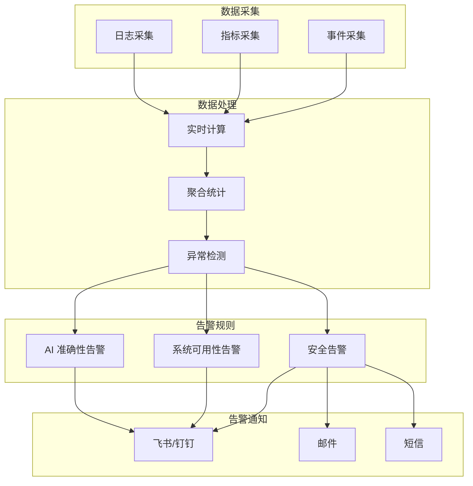

# AI-Ops 平台风险评估报告

> 版本：v1.0
> 日期：2026-02-26

---

## 一、风险矩阵

| 风险等级 | 发生概率 | 影响程度 | 响应优先级 |
|---------|---------|---------|-----------|
| 🔴 高风险 | 高 | 严重 | P0 - 必须解决 |
| 🟡 中风险 | 中 | 中等 | P1 - 需要关注 |
| 🟢 低风险 | 低 | 轻微 | P2 - 可以接受 |

---

## 二、高风险项（P0）

### R1: AI 幻觉导致误操作

**风险描述：**
- AI 误解用户意图，生成错误的 MCP 指令
- 即使有审批流，低危操作仍可能造成故障

**影响范围：**
- 服务中断
- 数据丢失
- 系统不稳定

**应对措施：**
| 措施 | 实施阶段 |
|------|---------|
| 多重意图校验 | Phase 1 |
| 执行前预览确认 | Phase 1 |
| 操作限速控制 | Phase 2 |
| 风险评级系统 | Phase 2 |

**监控指标：**
- 意图识别准确率 > 95%
- 用户取消率 < 5%
- 误操作率 < 0.1%

---

### R2: MCP 网关单点故障

**风险描述：**
- 所有指令都经过 MCP 网关
- 网关故障导致全平台瘫痪

**影响范围：**
- 所有运维操作无法执行
- 用户无法使用平台

**应对措施：**
| 措施 | 实施阶段 |
|------|---------|
| 网关集群化部署 | Phase 2 |
| 负载均衡配置 | Phase 2 |
| 降级策略（只读模式） | Phase 2 |
| 健康检查 + 自动故障转移 | Phase 3 |

**监控指标：**
- 网关可用性 > 99.9%
- 故障转移时间 < 30s
- P99 延迟 < 500ms

---

### R3: Agent 大规模掉线

**风险描述：**
- 网络抖动导致大量 Agent 重连
- 冲击集群中心，导致雪崩

**影响范围：**
- 大量机器失联
- 运维操作中断

**应对措施：**
| 措施 | 实施阶段 |
|------|---------|
| 指数退避重连算法 | Phase 1 |
| 心跳检测优化 | Phase 1 |
| 连接池扩容 | Phase 2 |
| 连接迁移机制 | Phase 3 |

**监控指标：**
- 重连风暴发生率 < 1次/天
- 集群中心 CPU < 80%（10K 连接）
- Agent 在线率 > 99.5%

---

### R4: 审计日志被篡改

**风险描述：**
- 管理员权限过高，可能删除/修改日志
- 合规审计失败

**影响范围：**
- 无法追溯操作历史
- 合规风险

**应对措施：**
| 措施 | 实施阶段 |
|------|---------|
| 只追加存储设计 | Phase 1 |
| WORM 存储集成 | Phase 3 |
| 权限分离（系统管理 vs 审计管理） | Phase 2 |
| 日志完整性校验 | Phase 3 |

**监控指标：**
- 日志完整性 100%
- 未授权访问尝试 0 次

---

## 三、中风险项（P1）

### R5: 渠道适配器兼容性问题

**风险描述：**
- 飞书、钉钉、企微消息格式差异大
- 部分渠道功能异常

**应对措施：**
| 措施 | 实施阶段 |
|------|---------|
| 统一消息抽象层 | Phase 1 |
| 各渠道专项测试 | Phase 2 |
| 降级处理（不支持的特性） | Phase 2 |

---

### R6: 知识库质量差

**风险描述：**
- 检索结果不准确
- 用户信任度下降

**应对措施：**
| 措施 | 实施阶段 |
|------|---------|
| 向量 + 关键词混合检索 | Phase 2 |
| 人工标注 FAQ | Phase 2 |
| 用户反馈优化 | Phase 3 |

---

### R7: 多租户隔离不彻底

**风险描述：**
- 不同租户数据可能泄露
- 权限控制漏洞

**应对措施：**
| 措施 | 实施阶段 |
|------|---------|
| tenant_id 全链路传递 | Phase 1 |
| 数据库行级隔离 | Phase 1 |
| 定期安全审计 | Phase 2 |

---

## 四、低风险项（P2）

### R8: LangGraph 学习曲线

**风险描述：**
- 对 LangGraph 熟悉度不足
- 研发效率下降

**应对措施：**
- 技术培训
- 文档沉淀
- 代码 Review

---

### R9: 知识库冷启动

**风险描述：**
- 初期知识库内容少
- 检索效果差

**应对措施：**
- 导入公开运维文档
- 内部 Wiki 迁移
- 逐步积累

---

## 五、风险监控仪表盘

### 5.1 监控流程图



### 5.2 监控指标

| 指标类别 | 监控项 | 告警阈值 |
|---------|--------|---------|
| **AI 准确性** | 意图识别准确率 | < 90% |
| **AI 准确性** | 用户取消率 | > 10% |
| **AI 准确性** | 误操作率 | > 0.5% |
| **系统可用性** | 网关可用性 | < 99.9% |
| **系统可用性** | Agent 在线率 | < 99% |
| **安全** | 未授权访问尝试 | > 0 |
| **安全** | 高危操作拦截失败 | > 0 |

---

## 六、风险处置时间线

### 6.1 处置流程图

```mermaid
flowchart LR
    subgraph POC[POC 阶段]
        P1[R1: 验证 AI<br/>意图识别准确率]
        P2[R2: 验证 MCP<br/>调用链路稳定性]
        P3[R3: 验证 Agent<br/>长连接稳定性]
    end
    
    subgraph PH1[Phase 1]
        A1[R1: 多重校验<br/>执行前预览]
        A2[R3: 指数退避重连]
        A3[R4: 只追加存储]
        A4[R7: tenant_id<br/>全链路]
    end
    
    subgraph PH2[Phase 2]
        B1[R2: 网关集群化]
        B2[R1: 操作限速<br/>风险评级]
        B3[R5: 渠道兼容性]
        B4[R6: 知识库集成]
    end
    
    subgraph PH3[Phase 3]
        C1[R2: 降级策略]
        C2[R3: 连接迁移]
        C3[R4: WORM 存储]
        C4[监控仪表盘]
    end
    
    POC --> PH1 --> PH2 --> PH3
```



### 6.2 详细时间线

```
POC 阶段
├── R1: 验证 AI 意图识别准确率
├── R2: 验证 MCP 调用链路稳定性
└── R3: 验证 Agent 长连接稳定性

Phase 1
├── R1: 实现多重校验 + 执行前预览
├── R3: 实现指数退避重连
├── R4: 实现只追加存储
└── R7: 实现 tenant_id 全链路

Phase 2
├── R2: 实现网关集群化
├── R1: 实现操作限速 + 风险评级
├── R5: 完成渠道兼容性测试
└── R6: 完成知识库集成

Phase 3
├── R2: 完善降级策略
├── R3: 实现连接迁移
├── R4: 实现 WORM 存储
└── 全面监控仪表盘上线
```

---

*报告结束*
